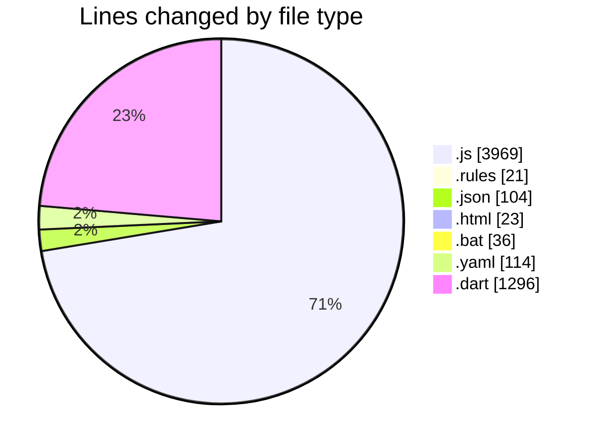
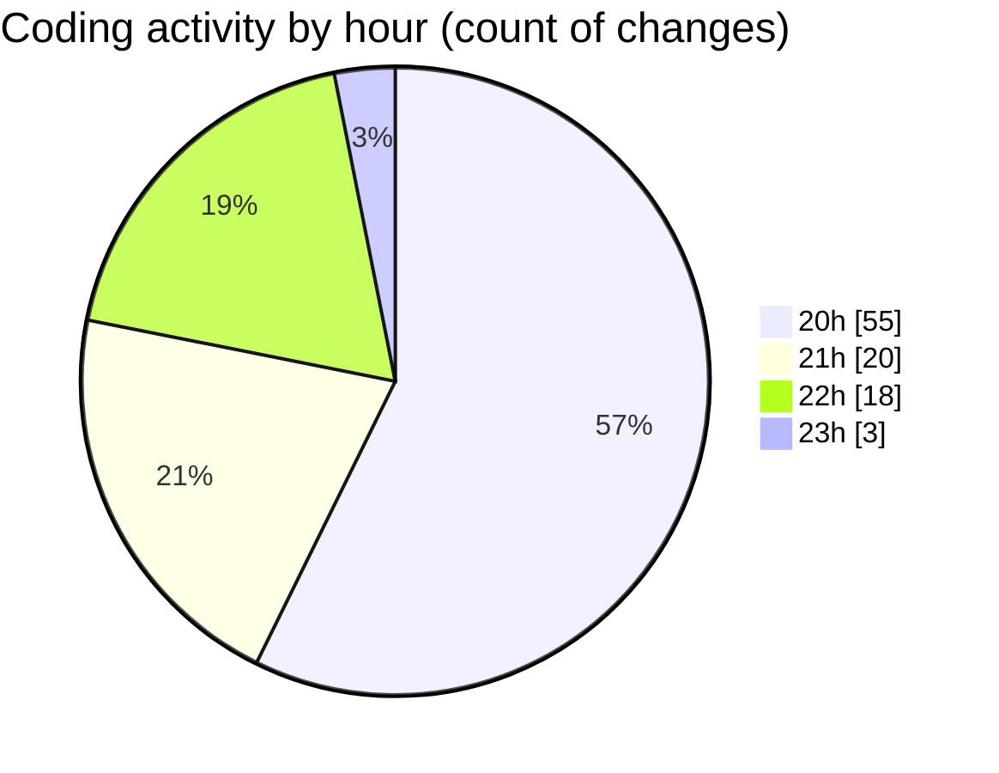

# 20m - Activity Summary 

## Overall Statistics

| Stat                   | Value                                                             |
| ---------------------- | ----------------------------------------------------------------- |
| **Lines Added** (➕)   | 4588                                          |
| **Lines Removed** (➖) | 975                                        |
| **Net Change** (↕)    | 3613                |
| **Active Time** (⌚)   | 90 minutes |

## Modified Files
- **firebase.js** (+30, -0)
- **firestore.rules** (+21, -0)
- **package.json** (+39, -0)
- **firebase.js** (+23, -0)
- **App.js** (+72, -0)
- **index.js** (+11, -0)
- **index.html** (+23, -0)
- **AuthContext.js** (+87, -0)
- **Login.js** (+125, -0)
- **Layout.js** (+151, -0)
- **Dashboard.js** (+220, -0)
- **AddYouTubeLink.js** (+202, -0)
- **EditYouTubeLink.js** (+202, -0)
- **package.json** (+49, -16)
- **firebase.js** (+51, -27)
- **App.js** (+146, -59)
- **HomeScreen.js** (+453, -192)
- **VideoCard.js** (+230, -0)
- **SearchBar.js** (+65, -0)
- **CategoryFilter.js** (+91, -0)
- **VideoDetailScreen.js** (+495, -342)
- **FavoritesScreen.js** (+142, -98)
- **ProfileScreen.js** (+278, -155)
- **index.js** (+6, -0)
- **metro.config.js** (+12, -0)
- **babel.config.js** (+4, -0)
- **start-project.bat** (+36, -0)
- **pubspec.yaml** (+110, -4)
- **main.dart** (+123, -72)
- **home_screen.dart** (+182, -0)
- **youtube_link.dart** (+64, -10)
- **firebase_service.dart** (+137, -0)
- **video_card.dart** (+133, -0)
- **login_screen.dart** (+175, -0)
- **admin_dashboard_screen.dart** (+325, -0)
- **firebase_options.dart** (+75, -0)

## Visualizations

### By File Type (Lines Changed)

### By Hour (Estimated Activity Count)

> **Last Updated:** 9/1/2025, 11:43:58 PM