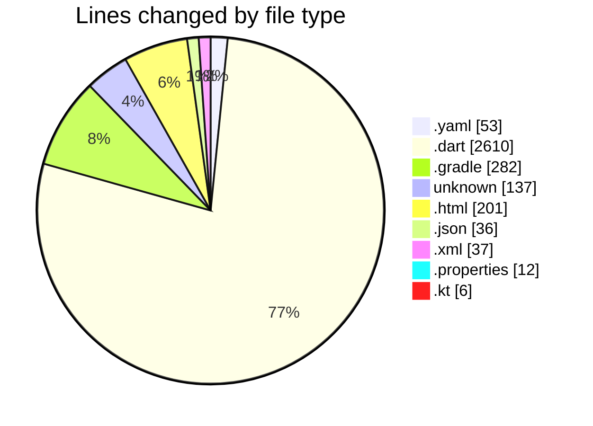
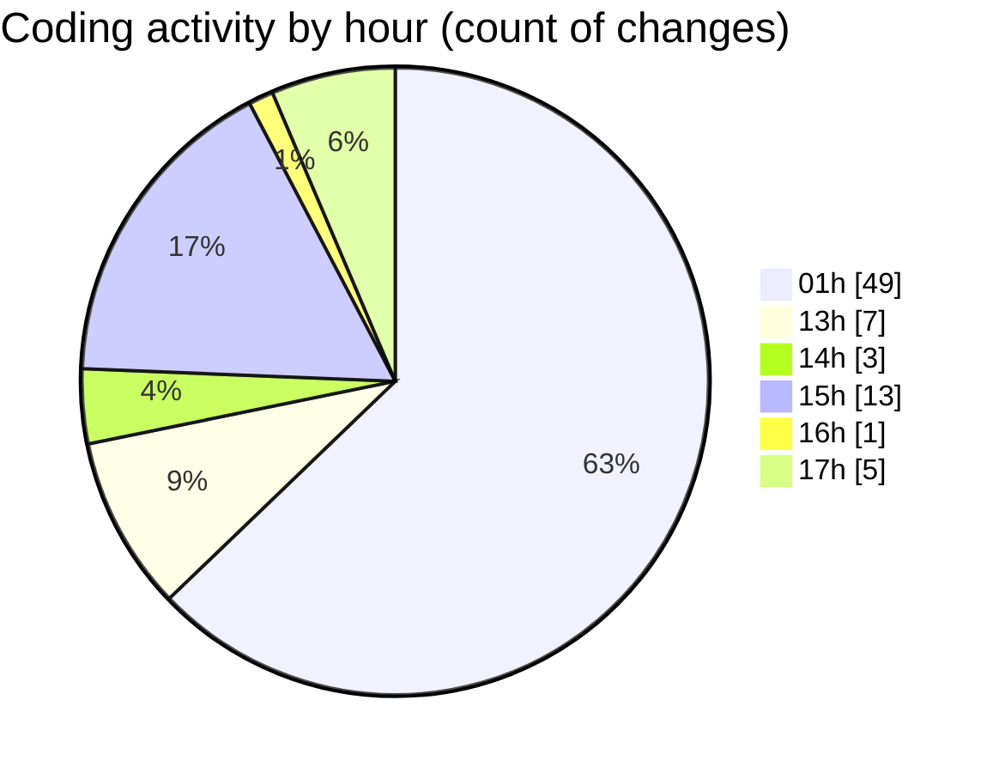

# quanLyLink - Activity Summary 

## Overall Statistics

| Stat                   | Value                                                             |
| ---------------------- | ----------------------------------------------------------------- |
| **Lines Added** (➕)   | 3282                                          |
| **Lines Removed** (➖) | 92                                        |
| **Net Change** (↕)    | 3190                |
| **Active Time** (⌚)   | 71 minutes |

## Modified Files
- **pubspec.yaml** (+27, -0)
- **main.dart** (+144, -0)
- **firebase_options.dart** (+102, -9)
- **youtube_link.dart** (+71, -0)
- **login_screen.dart** (+411, -0)
- **admin_dashboard.dart** (+549, -0)
- **link_form_dialog.dart** (+166, -0)
- **confirm_dialog.dart** (+39, -0)
- **pubspec.yaml** (+26, -0)
- **main.dart** (+214, -60)
- **firebase_options.dart** (+101, -0)
- **youtube_link.dart** (+79, -0)
- **home_screen.dart** (+331, -0)
- **link_card.dart** (+129, -0)
- **build.gradle** (+144, -0)
- **build.gradle** (+66, -0)
- **Podfile** (+47, -0)
- **index.html** (+201, -0)
- **.gitignore** (+90, -0)
- **manifest.json** (+36, -0)
- **AndroidManifest.xml** (+37, -0)
- **admin_first_setup.dart** (+204, -1)
- **gradle-wrapper.properties** (+6, -0)
- **gradle.properties** (+6, -0)
- **settings.gradle** (+50, -22)
- **MainActivity.kt** (+6, -0)

## Visualizations

### By File Type (Lines Changed)

### By Hour (Estimated Activity Count)

> **Last Updated:** 9/2/2025, 5:48:53 PM