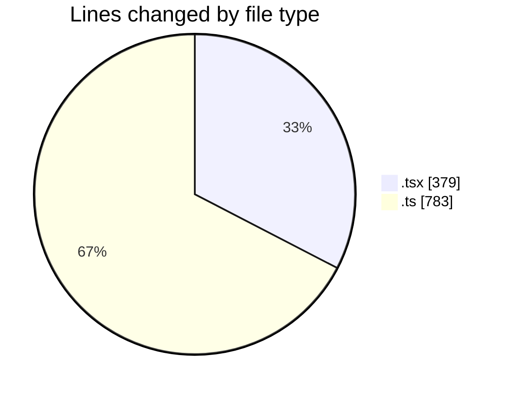
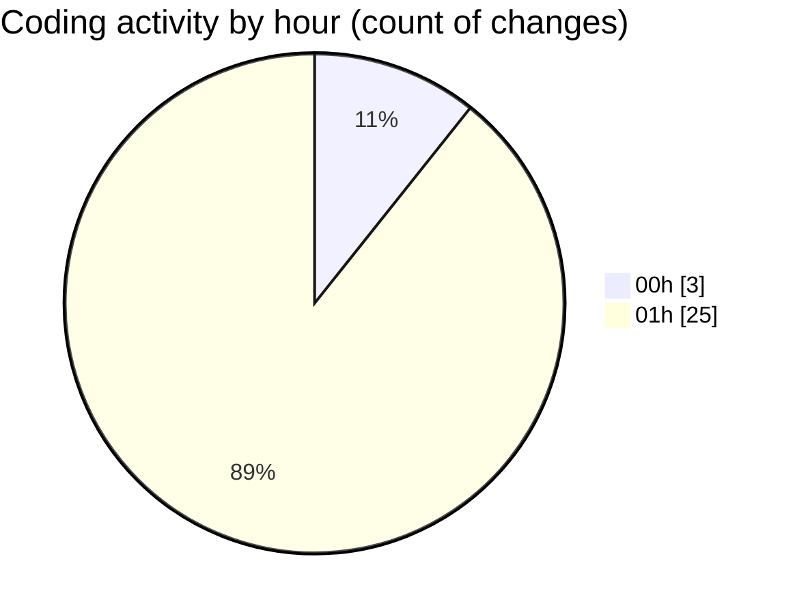

# hiAI-PHF - Activity Summary 

## Overall Statistics

| Stat                   | Value                                                             |
| ---------------------- | ----------------------------------------------------------------- |
| **Lines Added** (➕)   | 1154                                          |
| **Lines Removed** (➖) | 8                                        |
| **Net Change** (↕)    | 1146                |
| **Active Time** (⌚)   | 26 minutes |

## Modified Files
- **supplier-type-listing.tsx** (+40, -8)
- **supplier-type-listing-content.tsx** (+58, -0)
- **supplier.ts** (+32, -0)
- **supplier.ts** (+30, -0)
- **supplier.controller.ts** (+116, -0)
- **supplier.service.ts** (+364, -0)
- **supplier.route.ts** (+29, -0)
- **supplierApi.ts** (+153, -0)
- **supplier.ts** (+59, -0)
- **index.tsx** (+63, -0)
- **supplier-type-form-modal.tsx** (+210, -0)

## Visualizations

### By File Type (Lines Changed)

### By Hour (Estimated Activity Count)

> **Last Updated:** 9/5/2025, 1:38:29 AM