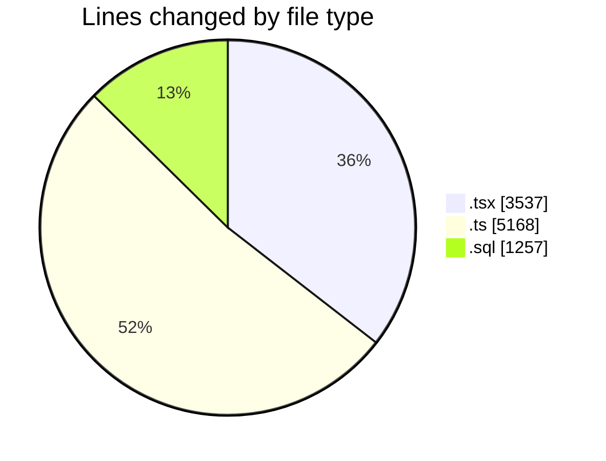
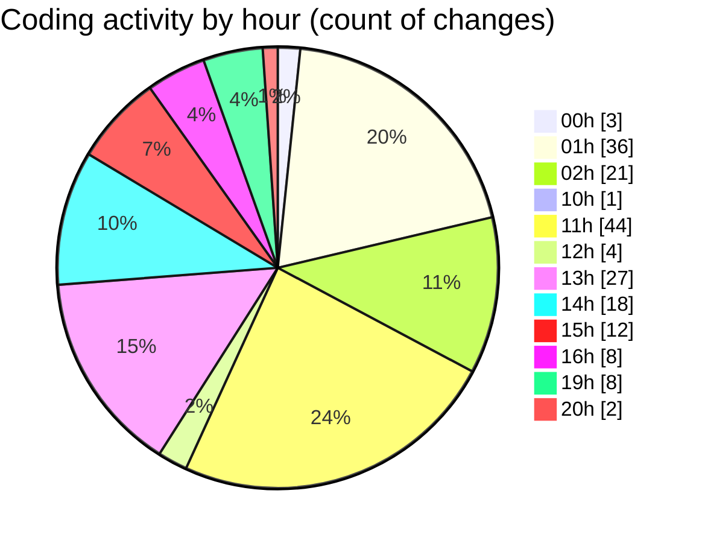

# hiAI-PHF - Activity Summary 

## Overall Statistics

| Stat                   | Value                                                             |
| ---------------------- | ----------------------------------------------------------------- |
| **Lines Added** (➕)   | 9510                                          |
| **Lines Removed** (➖) | 452                                        |
| **Net Change** (↕)    | 9058                |
| **Active Time** (⌚)   | 215 minutes |

## Modified Files
- **supplier-type-listing.tsx** (+107, -19)
- **supplier-type-listing-content.tsx** (+58, -3)
- **supplier.ts** (+32, -0)
- **supplier.ts** (+30, -0)
- **supplier.controller.ts** (+116, -0)
- **supplier.service.ts** (+364, -0)
- **supplier.route.ts** (+29, -0)
- **supplierApi.ts** (+153, -0)
- **supplier.ts** (+59, -0)
- **index.tsx** (+63, -2)
- **supplier-type-form-modal.tsx** (+223, -1)
- **use-table-filters.ts** (+80, -0)
- **columns.tsx** (+53, -0)
- **cell-action.tsx** (+66, -3)
- **delete-confirmation-modal.tsx** (+72, -2)
- **V01_inventories_data__update_inventory_menu.sql** (+33, -0)
- **warehouse-import.ts** (+117, -0)
- **warehouseImportApi.ts** (+515, -247)
- **columns.tsx** (+417, -12)
- **status-badge.tsx** (+62, -0)
- **cell-action.tsx** (+225, -7)
- **index.tsx** (+61, -14)
- **warehouse-import-filters.tsx** (+180, -0)
- **warehouse-import-form-modal.tsx** (+361, -0)
- **warehouse-import-listing.tsx** (+361, -25)
- **warehouse-import-listing-page.tsx** (+26, -0)
- **date-picker-with-range.tsx** (+80, -0)
- **utils.ts** (+129, -0)
- **data-table-skeleton-simple.tsx** (+73, -0)
- **simple-data-table.tsx** (+131, -0)
- **mock-data.ts** (+152, -0)
- **mockWarehouseImportApi.ts** (+162, -2)
- **page.tsx** (+18, -0)
- **store.ts** (+112, -0)
- **index.ts** (+3, -0)
- **page.tsx** (+31, -0)
- **V01_inventories_warehouse_import_menu.sql** (+48, -12)
- **warehouse-import-detail-page.tsx** (+26, -0)
- **warehouse-import-detail.tsx** (+230, -0)
- **warehouse-import-order-info.tsx** (+131, -12)
- **warehouse-import-supplier-info.tsx** (+76, -0)
- **warehouse-import-product-info.tsx** (+179, -0)
- **page.tsx** (+12, -0)
- **V01_Warehouse_Import_structure.sql** (+211, -0)
- **V02_Warehouse_Import_data.sql** (+204, -2)
- **warehouse_import_procedures.sql** (+454, -0)
- **warehouseImportController.ts** (+318, -0)
- **warehouseImportService.ts** (+761, -0)
- **warehouseImportDto.ts** (+235, -0)
- **warehouseImport.ts** (+276, -0)
- **warehouseImportDb.ts** (+807, -0)
- **warehouseImportRoutes.ts** (+114, -0)
- **V03_Warehouse_Import_codes.sql** (+86, -85)
- **run_warehouse_import_setup.sql** (+43, -0)
- **index.ts** (+67, -0)
- **warehouseImport.route.ts** (+284, -4)
- **auth-background-section.tsx** (+18, -0)
- **auth-layout.tsx** (+54, -0)
- **page.tsx** (+31, -0)
- **page.tsx** (+12, -0)
- **V27_Identity_data__update_warehouse_import_menu_link.sql** (+41, -0)
- **V03_Check_warehouse_import_data.sql** (+38, -0)

## Visualizations

### By File Type (Lines Changed)

### By Hour (Estimated Activity Count)

> **Last Updated:** 9/5/2025, 8:08:38 PM