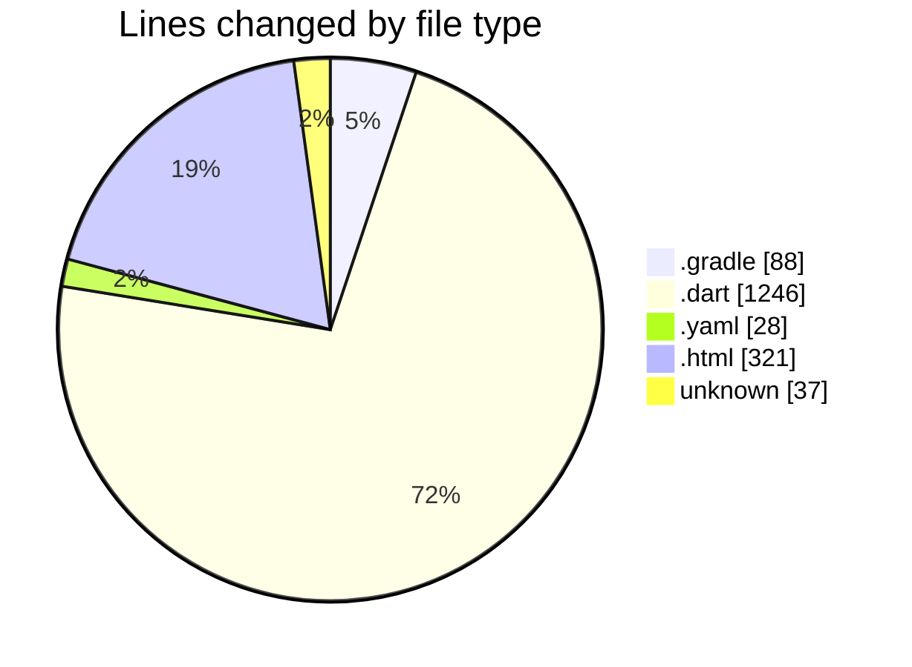
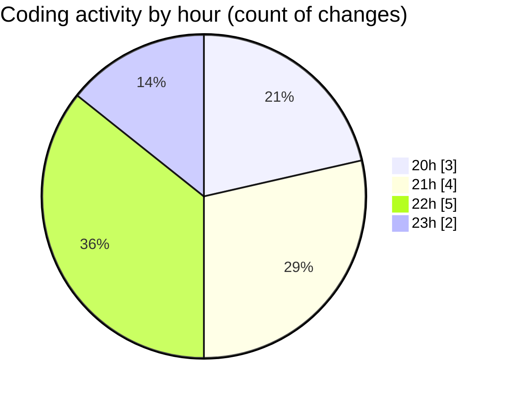

# quanLyLink - Activity Summary 

## Overall Statistics

| Stat                   | Value                                                             |
| ---------------------- | ----------------------------------------------------------------- |
| **Lines Added** (➕)   | 1720                                          |
| **Lines Removed** (➖) | 0                                        |
| **Net Change** (↕)    | 1720                |
| **Active Time** (⌚)   | 9 minutes |

## Modified Files
- **build.gradle** (+88, -0)
- **admin_support.dart** (+149, -0)
- **admin_shell.dart** (+209, -0)
- **main.dart** (+184, -0)
- **support_public.dart** (+94, -0)
- **admin_dashboard.dart** (+397, -0)
- **pubspec.yaml** (+28, -0)
- **index.html** (+115, -0)
- **index.html** (+103, -0)
- **index.html** (+103, -0)
- **admin_settings.dart** (+213, -0)
- **.htaccess** (+25, -0)
- **.htaccess** (+12, -0)

## Visualizations

### By File Type (Lines Changed)

### By Hour (Estimated Activity Count)

> **Last Updated:** 9/7/2025, 11:27:12 PM