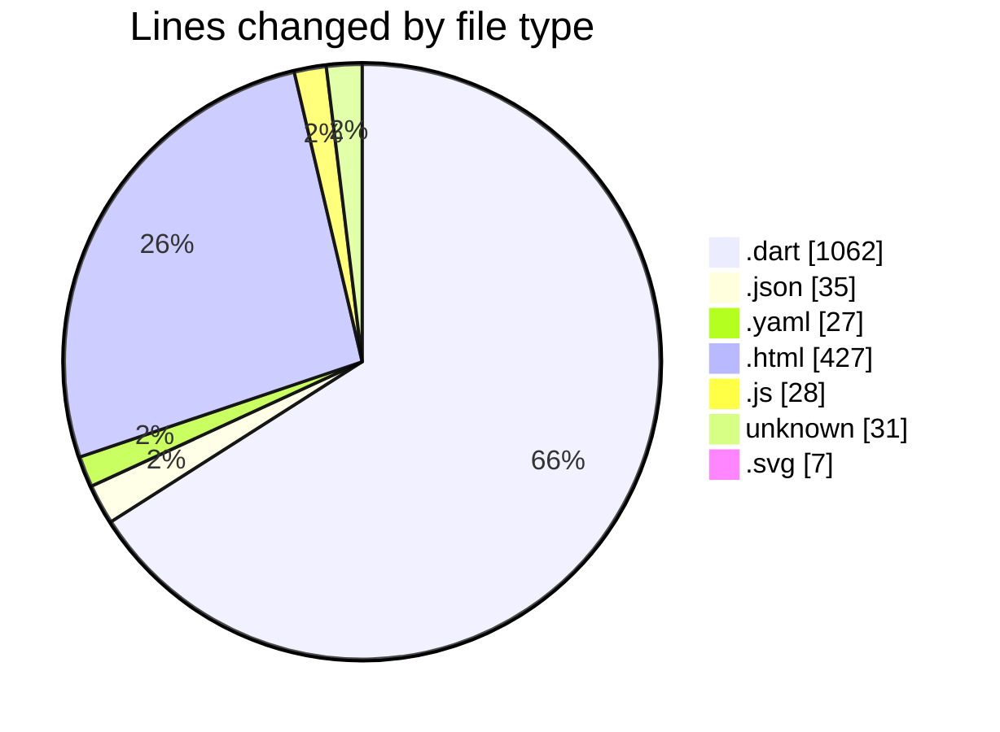
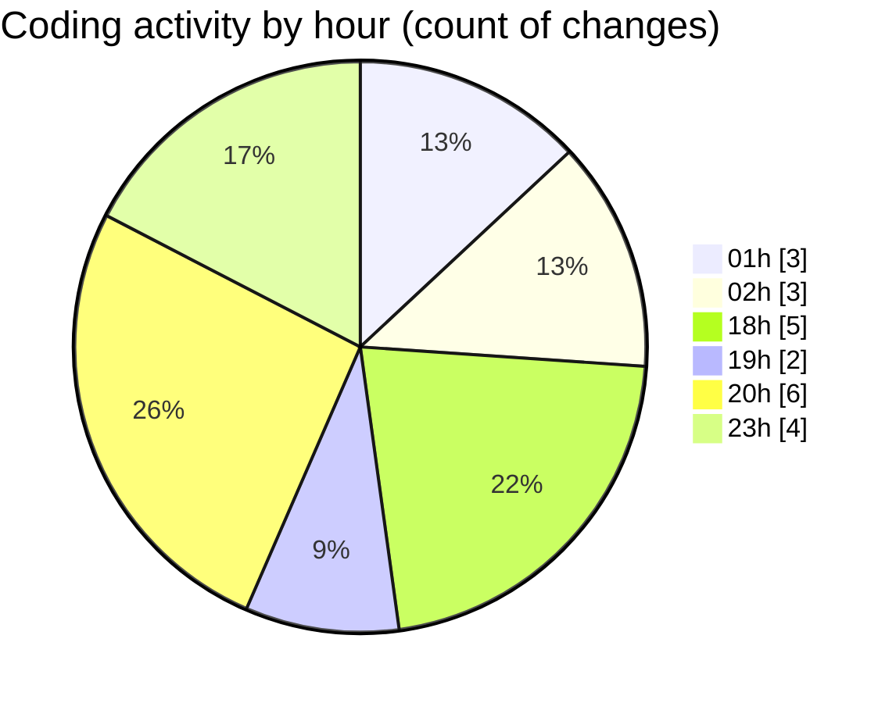

# quanLyLink - Activity Summary 

## Overall Statistics

| Stat                   | Value                                                             |
| ---------------------- | ----------------------------------------------------------------- |
| **Lines Added** (➕)   | 1573                                          |
| **Lines Removed** (➖) | 44                                        |
| **Net Change** (↕)    | 1529                |
| **Active Time** (⌚)   | 22 minutes |

## Modified Files
- **youtube_link.dart** (+115, -0)
- **youtube_link.dart** (+129, -0)
- **link_form_dialog.dart** (+259, -0)
- **link_card.dart** (+253, -0)
- **manifest.json** (+24, -11)
- **home_screen.dart** (+306, -0)
- **pubspec.yaml** (+27, -0)
- **index.html** (+85, -0)
- **index.html** (+138, -33)
- **firebase-config.js** (+28, -0)
- **index.html** (+107, -0)
- **.htaccess** (+31, -0)
- **favicon.svg** (+7, -0)
- **index.html** (+64, -0)

## Visualizations

### By File Type (Lines Changed)

### By Hour (Estimated Activity Count)

> **Last Updated:** 9/8/2025, 8:37:18 PM