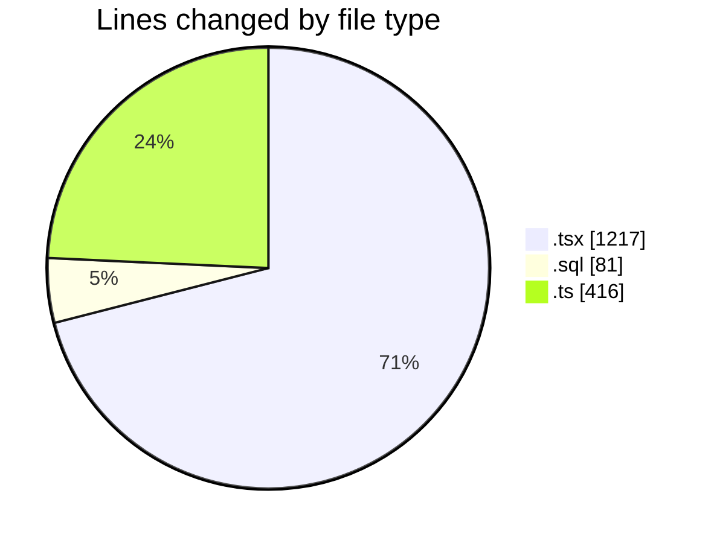
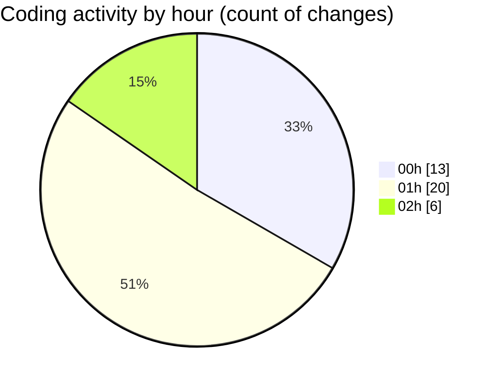

# hiAI-PHF - Activity Summary 

## Overall Statistics

| Stat                   | Value                                                             |
| ---------------------- | ----------------------------------------------------------------- |
| **Lines Added** (➕)   | 1564                                          |
| **Lines Removed** (➖) | 150                                        |
| **Net Change** (↕)    | 1414                |
| **Active Time** (⌚)   | 56 minutes |

## Modified Files
- **page.tsx** (+13, -0)
- **V27_Identity_data__update_warehouse_import_menu_link.sql** (+42, -0)
- **V03_Check_warehouse_import_data.sql** (+39, -0)
- **page.tsx** (+34, -18)
- **warehouse-import-detail.tsx** (+121, -18)
- **supplier.db-prisma.ts** (+204, -0)
- **warehouse-import-listing.tsx** (+171, -30)
- **index.tsx** (+46, -1)
- **sample-data.ts** (+211, -0)
- **columns.tsx** (+134, -0)
- **layout.tsx** (+6, -0)
- **warehouse-import-detail-page.tsx** (+19, -0)
- **page.tsx** (+1, -0)
- **warehouse-import-listing-page.tsx** (+1, -0)
- **mock-data.ts** (+1, -0)
- **page.tsx** (+17, -0)
- **warehouse-import-create-page.tsx** (+504, -83)

## Visualizations

### By File Type (Lines Changed)

### By Hour (Estimated Activity Count)

> **Last Updated:** 9/9/2025, 2:14:19 AM