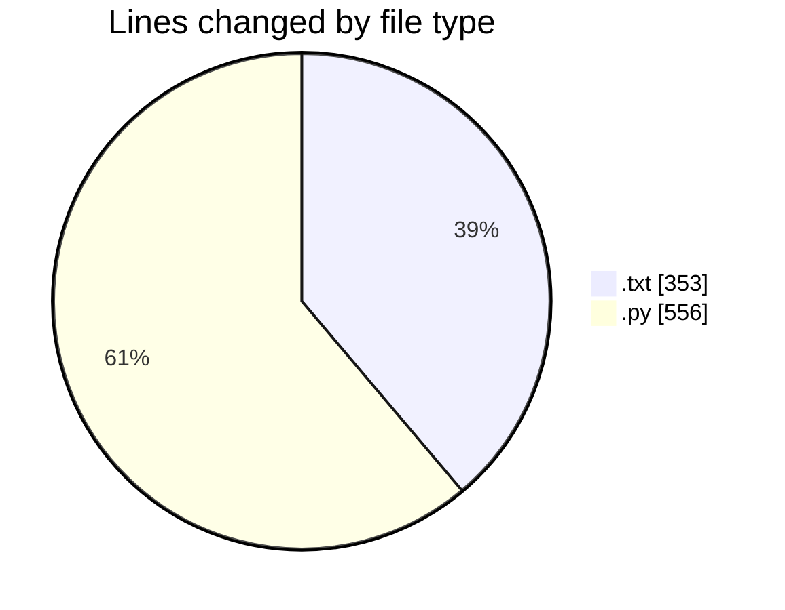

# data - Activity Summary 

## Overall Statistics

| Stat                   | Value                                                             |
| ---------------------- | ----------------------------------------------------------------- |
| **Lines Added** (➕)   | 887                                          |
| **Lines Removed** (➖) | 22                                        |
| **Net Change** (↕)    | 865                |
| **Active Time** (⌚)   | 31 minutes |

## Modified Files
- **data.txt** (+347, -3)
- **create_excel_form.py** (+197, -19)
- **requirements.txt** (+3, -0)
- **export_data.py** (+35, -0)
- **simple_export.py** (+79, -0)
- **clean_data_export.py** (+95, -0)
- **final_export.py** (+93, -0)
- **show_data.py** (+38, -0)

## Visualizations

### By File Type (Lines Changed)

### By Hour (Estimated Activity Count)

> **Last Updated:** 9/10/2025, 2:00:18 PM