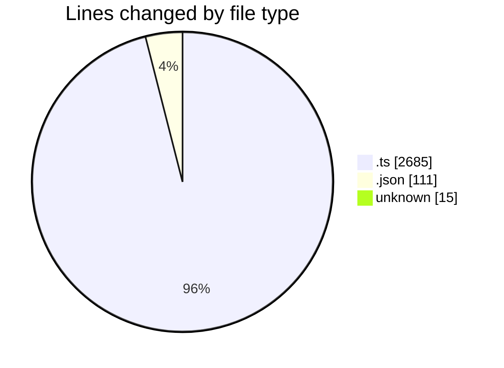
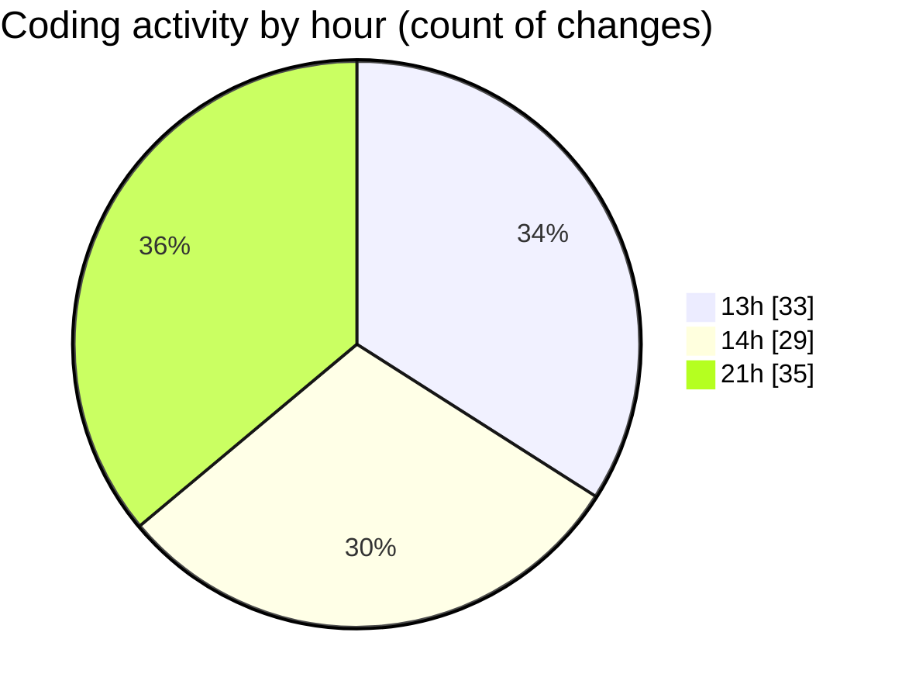

# hiAI-PHF - Activity Summary 

## Overall Statistics

| Stat                   | Value                                                             |
| ---------------------- | ----------------------------------------------------------------- |
| **Lines Added** (➕)   | 2272                                          |
| **Lines Removed** (➖) | 539                                        |
| **Net Change** (↕)    | 1733                |
| **Active Time** (⌚)   | 117 minutes |

## Modified Files
- **customer.service.ts** (+461, -56)
- **supplier.db-prisma.ts** (+645, -317)
- **supplier.service.ts** (+500, -61)
- **index.ts** (+64, -9)
- **supplier.ts** (+117, -41)
- **supplier.route.ts** (+46, -7)
- **supplier.ts** (+113, -48)
- **package.json** (+71, -0)
- **.gitignore** (+15, -0)
- **settings.json** (+40, -0)
- **transform.ts** (+18, -0)
- **customer.ts** (+126, -0)
- **common.constant.ts** (+56, -0)

## Visualizations

### By File Type (Lines Changed)

### By Hour (Estimated Activity Count)

> **Last Updated:** 9/13/2025, 9:35:09 PM