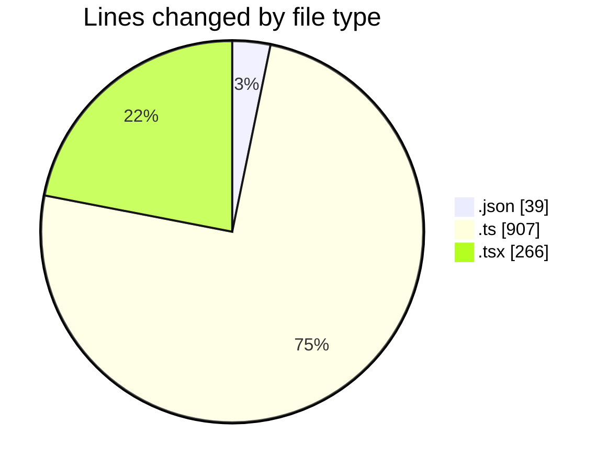
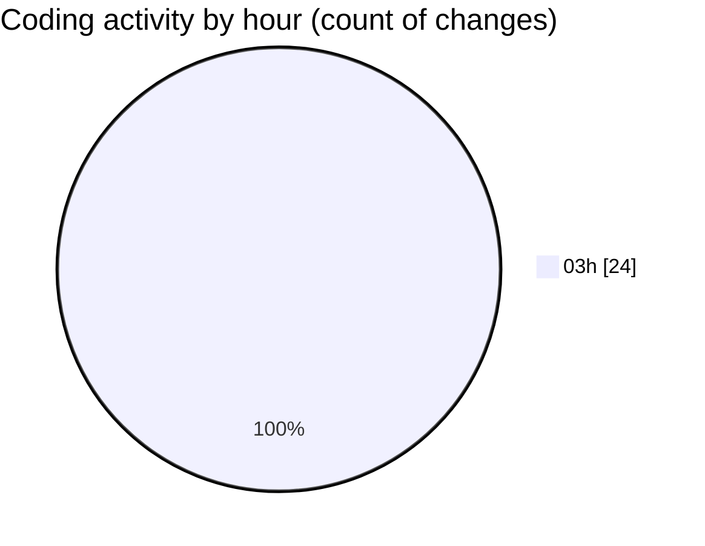

# napXUVN - Activity Summary 

## Overall Statistics

| Stat                   | Value                                                             |
| ---------------------- | ----------------------------------------------------------------- |
| **Lines Added** (➕)   | 1132                                          |
| **Lines Removed** (➖) | 80                                        |
| **Net Change** (↕)    | 1052                |
| **Active Time** (⌚)   | 29 minutes |

## Modified Files
- **package.json** (+39, -0)
- **tiktok-login.ts** (+268, -11)
- **route.ts** (+89, -9)
- **route.ts** (+54, -0)
- **tiktok-login.tsx** (+203, -0)
- **page.tsx** (+63, -0)
- **puppeteer-config.ts** (+138, -60)
- **tiktok-login-playwright.ts** (+278, -0)

## Visualizations

### By File Type (Lines Changed)

### By Hour (Estimated Activity Count)

> **Last Updated:** 9/13/2025, 3:43:51 AM