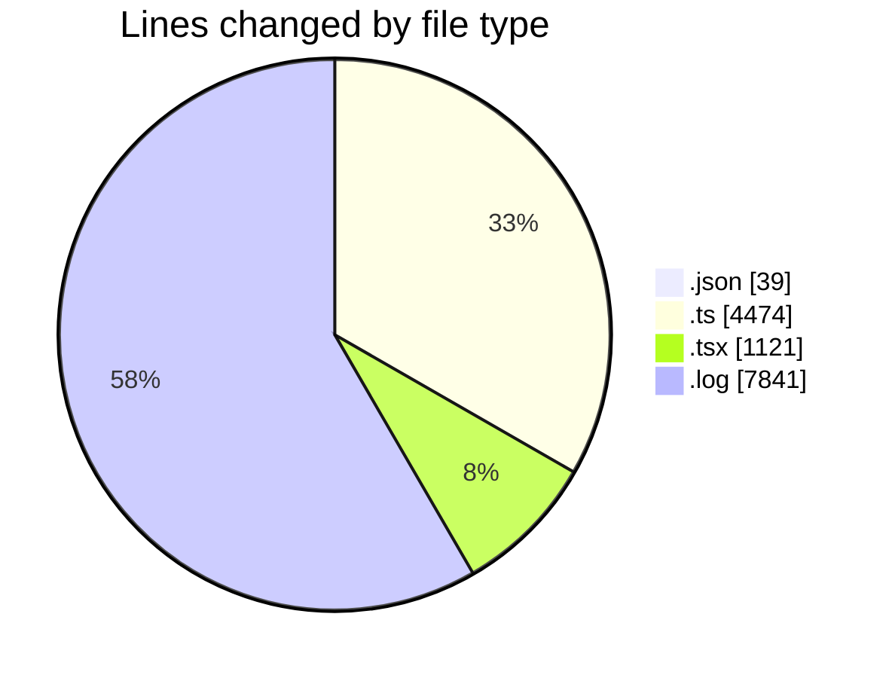
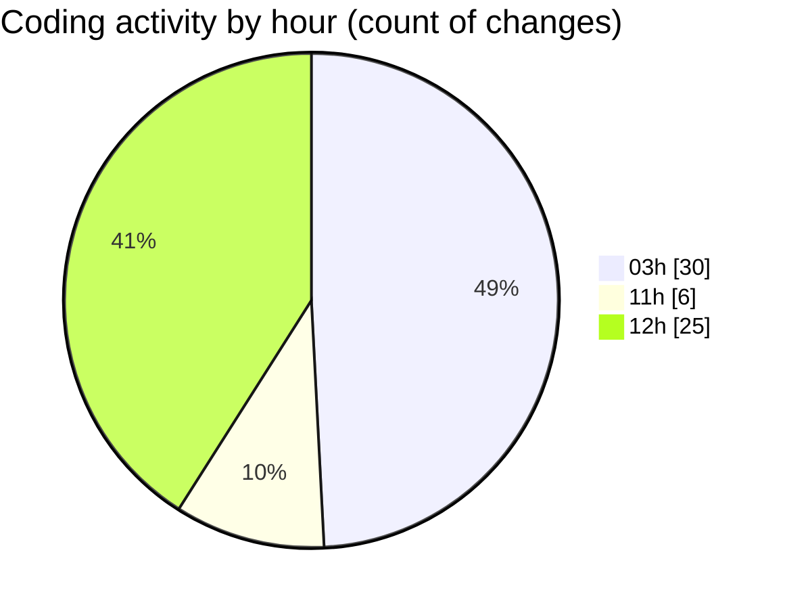

# napXUVN - Activity Summary 

## Overall Statistics

| Stat                   | Value                                                             |
| ---------------------- | ----------------------------------------------------------------- |
| **Lines Added** (➕)   | 12802                                          |
| **Lines Removed** (➖) | 673                                        |
| **Net Change** (↕)    | 12129                |
| **Active Time** (⌚)   | 73 minutes |

## Modified Files
- **package.json** (+39, -0)
- **tiktok-login.ts** (+271, -26)
- **route.ts** (+176, -9)
- **route.ts** (+54, -0)
- **tiktok-login.tsx** (+203, -0)
- **page.tsx** (+63, -0)
- **puppeteer-config.ts** (+139, -60)
- **tiktok-login-playwright.ts** (+652, -13)
- **tiktok-login-stealth.ts** (+282, -0)
- **page.tsx** (+253, -0)
- **route.ts** (+131, -0)
- **tiktok-qr-enhanced.ts** (+456, -0)
- **route.ts** (+42, -0)
- **route.ts** (+62, -0)
- **tiktok-coin-qr.ts** (+1071, -524)
- **route.ts** (+43, -0)
- **route.ts** (+62, -0)
- **tiktok-coin-qr.tsx** (+335, -0)
- **page.tsx** (+131, -0)
- **tiktok-coin-simple.ts** (+254, -41)
- **route.ts** (+41, -0)
- **chrome-config.ts** (+65, -0)
- **page.tsx** (+136, -0)
- **log.log** (+7841, -0)

## Visualizations

### By File Type (Lines Changed)

### By Hour (Estimated Activity Count)

> **Last Updated:** 9/13/2025, 12:31:02 PM