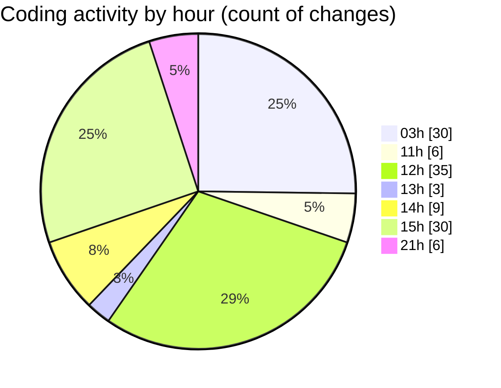

# napXUVN - Activity Summary 

## Overall Statistics

| Stat                   | Value                                                             |
| ---------------------- | ----------------------------------------------------------------- |
| **Lines Added** (➕)   | 15589                                          |
| **Lines Removed** (➖) | 718                                        |
| **Net Change** (↕)    | 14871                |
| **Active Time** (⌚)   | 137 minutes |

## Modified Files
- **package.json** (+39, -0)
- **tiktok-login.ts** (+271, -26)
- **route.ts** (+176, -9)
- **route.ts** (+54, -0)
- **tiktok-login.tsx** (+203, -0)
- **page.tsx** (+63, -0)
- **puppeteer-config.ts** (+139, -60)
- **tiktok-login-playwright.ts** (+652, -13)
- **tiktok-login-stealth.ts** (+296, -0)
- **page.tsx** (+340, -0)
- **route.ts** (+131, -0)
- **tiktok-qr-enhanced.ts** (+456, -0)
- **route.ts** (+42, -0)
- **route.ts** (+62, -0)
- **tiktok-coin-qr.ts** (+1071, -524)
- **route.ts** (+43, -0)
- **route.ts** (+62, -0)
- **tiktok-coin-qr.tsx** (+335, -0)
- **page.tsx** (+131, -0)
- **tiktok-coin-simple.ts** (+254, -41)
- **route.ts** (+41, -0)
- **chrome-config.ts** (+65, -0)
- **page.tsx** (+136, -0)
- **log.log** (+7841, -0)
- **tiktok-rate-limit-handler.ts** (+59, -0)
- **browser-cleaner.ts** (+112, -0)
- **route.ts** (+32, -0)
- **tiktok-ultra-stealth.ts** (+407, -0)
- **route.ts** (+34, -0)
- **graph.txt** (+102, -0)
- **napxu-tiktok-api.ts** (+194, -22)
- **route.ts** (+35, -0)
- **route.ts** (+33, -0)
- **napxu-tiktok-qr.tsx** (+248, -23)
- **page.tsx** (+102, -0)
- **countdown-timer.tsx** (+70, -0)
- **page.tsx** (+297, -0)
- **route.ts** (+33, -0)
- **route.ts** (+34, -0)
- **route.ts** (+34, -0)
- **napxu-webcast-api.ts** (+153, -0)
- **route.ts** (+32, -0)
- **route.ts** (+48, -0)
- **napxu-webcast-qr.tsx** (+226, -0)
- **page.tsx** (+62, -0)
- **tiktok-coin-stealth.ts** (+339, -0)

## Visualizations

### By File Type (Lines Changed)

### By Hour (Estimated Activity Count)

> **Last Updated:** 9/13/2025, 10:00:09 PM