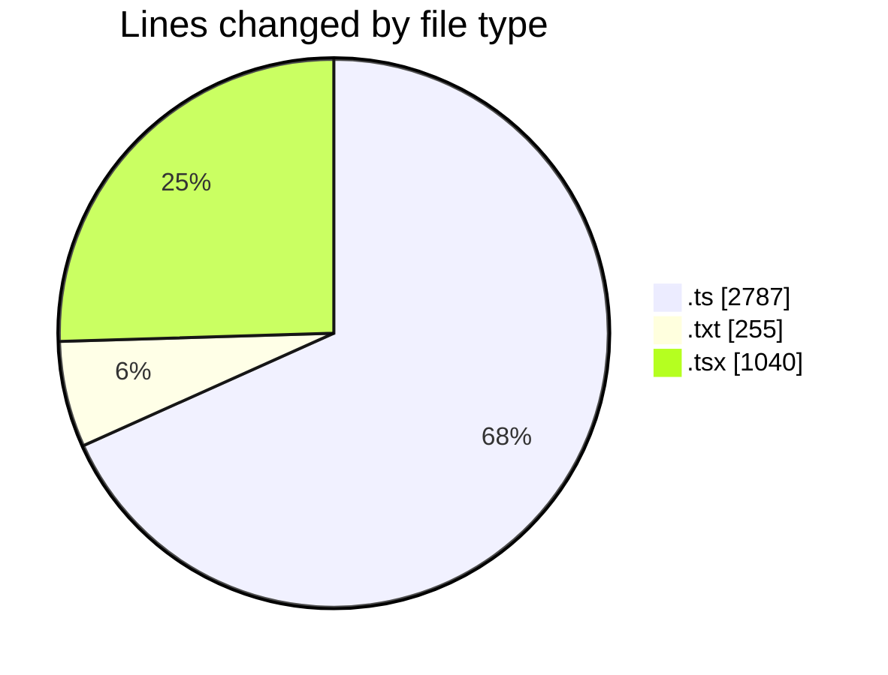
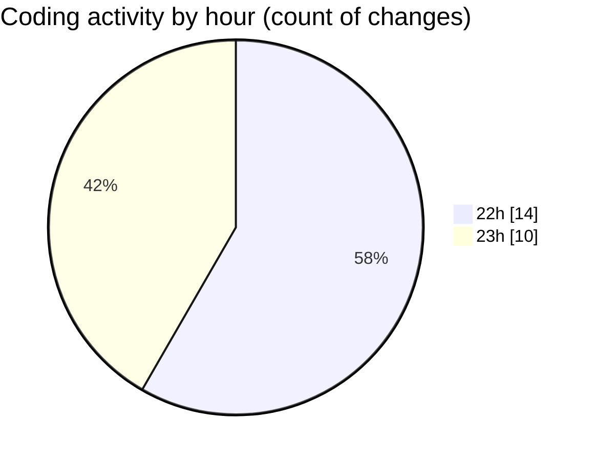

# hiAI-PHF - Activity Summary 

## Overall Statistics

| Stat                   | Value                                                             |
| ---------------------- | ----------------------------------------------------------------- |
| **Lines Added** (➕)   | 4071                                          |
| **Lines Removed** (➖) | 11                                        |
| **Net Change** (↕)    | 4060                |
| **Active Time** (⌚)   | 27 minutes |

## Modified Files
- **supplier.ts** (+66, -0)
- **index.ts** (+55, -0)
- **supplier.ts** (+76, -1)
- **customer.service.ts** (+405, -1)
- **transform.ts** (+18, -0)
- **supplier.db-prisma.ts** (+328, -0)
- **customer.db-prisma.ts** (+955, -0)
- **department.service.ts** (+394, -0)
- **supplier.route.ts** (+45, -0)
- **supplier.service.ts** (+439, -4)
- **Supplier_API_Postman_Collection.txt** (+255, -0)
- **page.tsx** (+12, -1)
- **supplier-type-form-modal.tsx** (+222, -4)
- **supplier-type-listing-content.tsx** (+53, -0)
- **use-breadcrumbs.tsx** (+748, -0)

## Visualizations

### By File Type (Lines Changed)

### By Hour (Estimated Activity Count)

> **Last Updated:** 9/14/2025, 11:28:09 PM