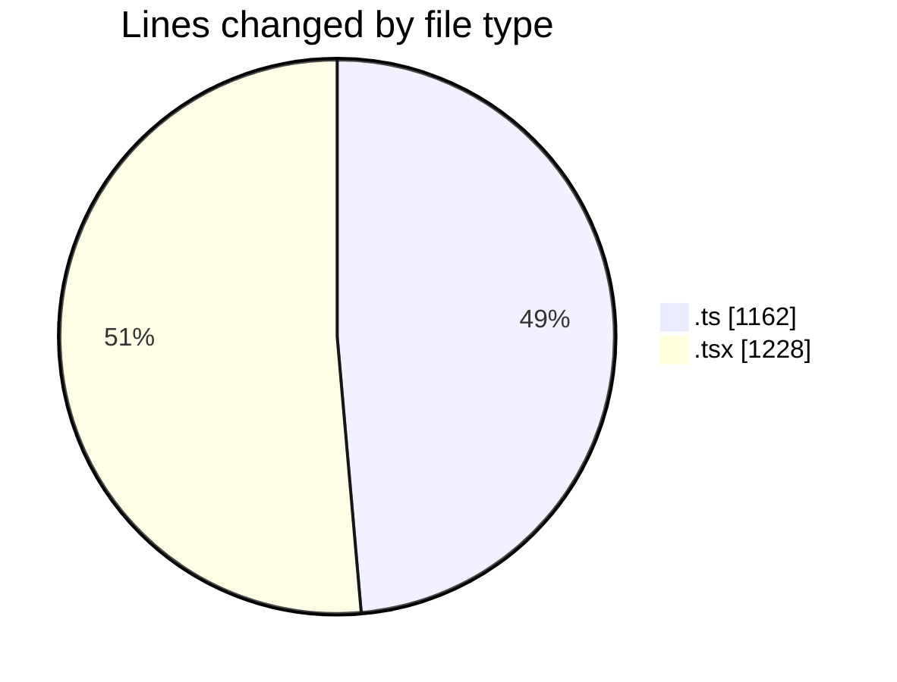
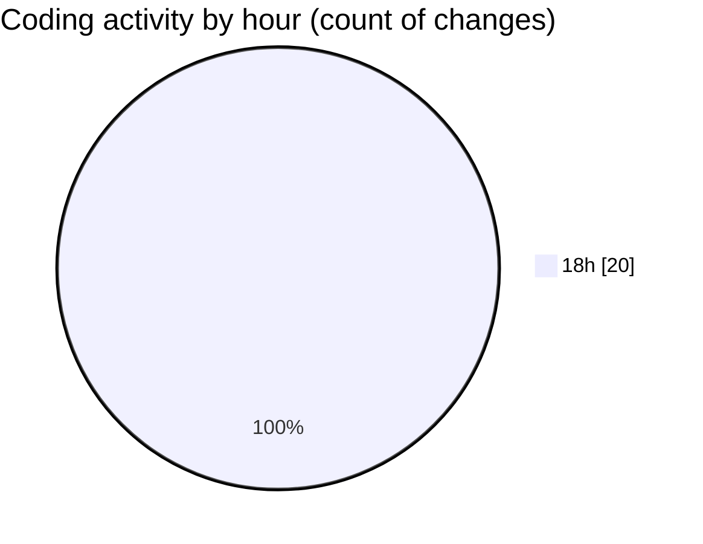

# napXUVN - Activity Summary 

## Overall Statistics

| Stat                   | Value                                                             |
| ---------------------- | ----------------------------------------------------------------- |
| **Lines Added** (➕)   | 2390                                          |
| **Lines Removed** (➖) | 0                                        |
| **Net Change** (↕)    | 2390                |
| **Active Time** (⌚)   | 19 minutes |

## Modified Files
- **route.ts** (+33, -0)
- **route.ts** (+34, -0)
- **countdown-timer.tsx** (+71, -0)
- **page.tsx** (+297, -0)
- **route.ts** (+35, -0)
- **route.ts** (+35, -0)
- **napxu-webcast-api.ts** (+154, -0)
- **route.ts** (+33, -0)
- **route.ts** (+49, -0)
- **napxu-webcast-qr.tsx** (+227, -0)
- **page.tsx** (+63, -0)
- **route.ts** (+34, -0)
- **tiktok-coin-stealth-qr.tsx** (+221, -0)
- **tiktok-chrome-connector.ts** (+693, -0)
- **route.ts** (+33, -0)
- **route.ts** (+29, -0)
- **page.tsx** (+349, -0)

## Visualizations

### By File Type (Lines Changed)

### By Hour (Estimated Activity Count)

> **Last Updated:** 9/14/2025, 6:34:58 PM