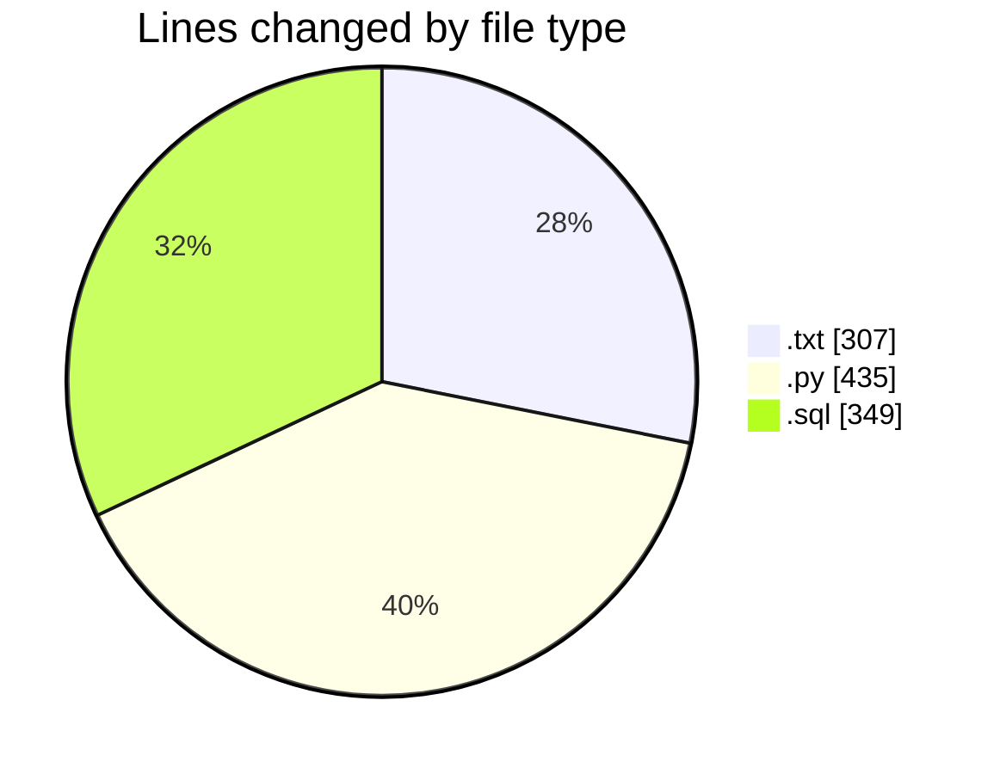
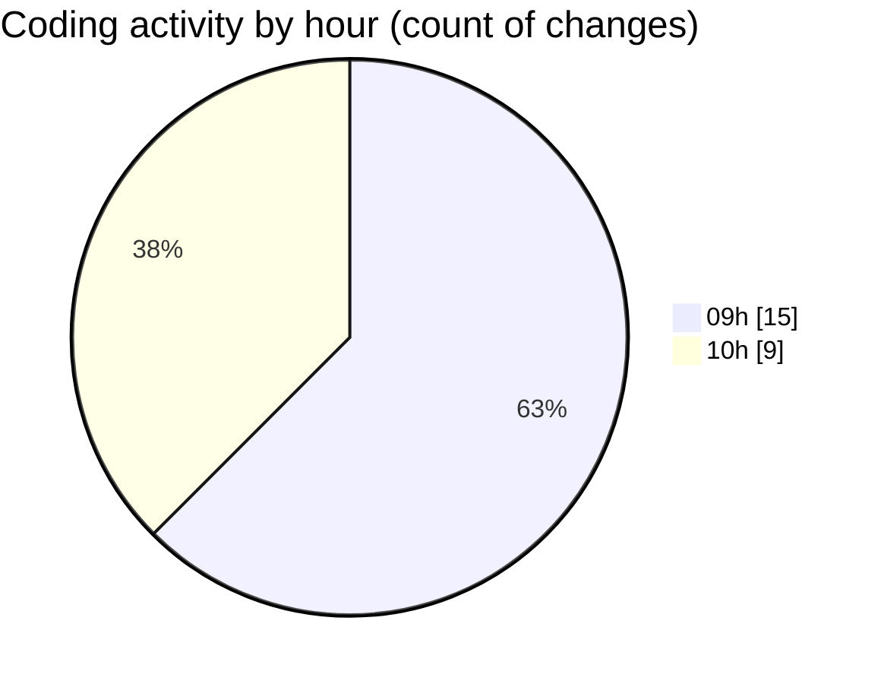

# dataNV - Activity Summary 

## Overall Statistics

| Stat                   | Value                                                             |
| ---------------------- | ----------------------------------------------------------------- |
| **Lines Added** (➕)   | 942                                          |
| **Lines Removed** (➖) | 149                                        |
| **Net Change** (↕)    | 793                |
| **Active Time** (⌚)   | 23 minutes |

## Modified Files
- **structuresql.txt** (+178, -129)
- **generate_departments_sql.py** (+258, -0)
- **run_departments_generator.py** (+41, -0)
- **debug_excel_data.py** (+58, -0)
- **summary_departments.py** (+78, -0)
- **departments_insert.sql** (+329, -20)

## Visualizations

### By File Type (Lines Changed)

### By Hour (Estimated Activity Count)

> **Last Updated:** 9/16/2025, 10:30:44 AM