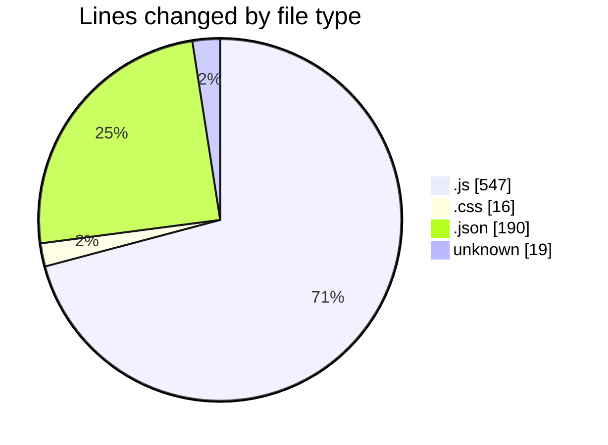
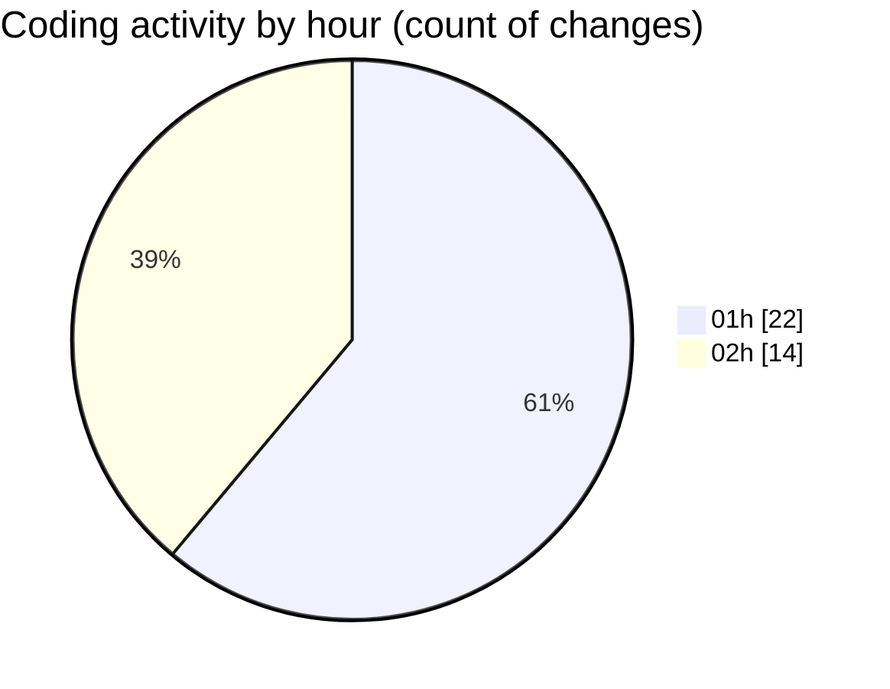

# quytuthien.vn - Activity Summary 

## Overall Statistics

| Stat                   | Value                                                             |
| ---------------------- | ----------------------------------------------------------------- |
| **Lines Added** (➕)   | 743                                          |
| **Lines Removed** (➖) | 29                                        |
| **Net Change** (↕)    | 714                |
| **Active Time** (⌚)   | 57 minutes |

## Modified Files
- **Contact.js** (+64, -0)
- **Contact.css** (+16, -0)
- **App.js** (+0, -4)
- **package.json** (+22, -0)
- **firebase.js** (+40, -0)
- **index.js** (+117, -0)
- **.env** (+7, -1)
- **firebase.js** (+29, -0)
- **firebase.example.js** (+40, -0)
- **.env** (+10, -1)
- **seed.js** (+177, -0)
- **activities.json** (+23, -0)
- **news.json** (+29, -0)
- **settings.json** (+11, -0)
- **banks.json** (+19, -0)
- **charity-funds.json** (+19, -0)
- **transactions.json** (+23, -0)
- **users.json** (+23, -0)
- **shop.json** (+21, -0)
- **api.js** (+26, -0)
- **News.js** (+0, -13)
- **Activities.js** (+7, -0)
- **ActivityDetails.js** (+0, -10)
- **Statistics.js** (+20, -0)

## Visualizations

### By File Type (Lines Changed)

### By Hour (Estimated Activity Count)

> **Last Updated:** 9/17/2025, 2:12:06 AM